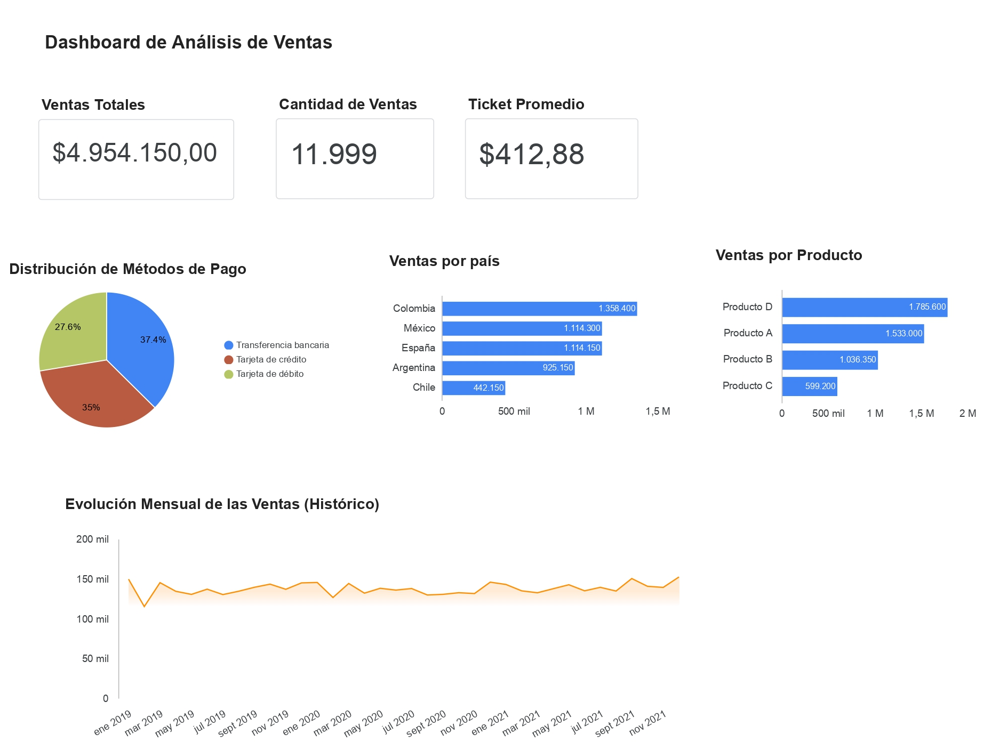

# Analisis-de-Ventas
# 📊 Proyecto 1 - Análisis de Ventas con Python y Data Studio

## 📌 Descripción

Este proyecto presenta un análisis exploratorio de un conjunto de datos de ventas utilizando Python.

Se realizó la limpieza y exploración de los datos, el cálculo de indicadores clave (KPIs) y el desarrollo de un dashboard interactivo en Data Studio para visualizar los principales resultados.

---

## 🎯 Objetivos

- Explorar y comprender el conjunto de datos.
- Limpiar y preparar la información para el análisis.
- Calcular indicadores clave de ventas (KPIs).
- Crear visualizaciones para facilitar la interpretación de los datos.
- Desarrollar un dashboard interactivo en Data Studio.

---

## 🛠️ Tecnologías utilizadas

- Python
- pandas
- matplotlib
- Google Colab
- Data Studio

---

## 📈 Indicadores analizados

- 💰 Ventas Totales
- 📦 Cantidad de Ventas
- 📈 Ticket Promedio
- 🌎 Ventas por País
- 📊 Ventas por Producto
- 💳 Ventas por Método de Pago
- 📅 Evolución de las Ventas

---

## 🖼️ Dashboard

---

## 🔎 Hallazgos

A partir del análisis realizado, se obtuvieron los siguientes resultados:

- Las **ventas totales** fueron de **$4.594.150**.

- **Colombia** fue el país con mayor volumen de ventas, con **$1.358.400**, representando aproximadamente el **29,6% de las ventas totales**.

- Al analizar las ventas de Colombia por producto, el **Producto D** fue el que generó mayor facturación, con **$487.200**.

- El Producto D representó aproximadamente el **35,9% de las ventas de Colombia**.

- La mayor facturación del Producto D se explica principalmente por una **mayor cantidad de unidades vendidas**.

## 💡 Conclusión Final

El análisis permitió identificar que Colombia fue el país con mayor volumen de ventas dentro del conjunto analizado. Al profundizar en este mercado, se observó que el Producto D fue el principal generador de facturación.

El análisis no se limitó a identificar qué país y qué producto registraban las mayores ventas, sino que permitió profundizar en los datos para comprender qué factor contribuía a ese resultado. En el caso del Producto D, su mayor facturación estuvo principalmente relacionada con una mayor cantidad de unidades vendidas.

De esta manera, el proyecto permitió pasar de una visión general de las ventas a un análisis más detallado, utilizando los datos para identificar patrones y generar nuevas preguntas sobre el comportamiento comercial.

## 🔗 Enlaces

📓 **Google Colab**

https://colab.research.google.com/drive/112PTACisVjGqnl0EIitdF9uxb6M_oGEF#scrollTo=eb06f6ea

📊 **Dashboard Interactivo (Data Studio)**

https://datastudio.google.com/u/0/reporting/34d63601-547c-45ac-8560-b3087e307984/page/rEB4F

---

## 📂 Contenido del repositorio

- `BD Ventas.xlsx`
- `README.md`
- `analisis_ventas.ipynb`
- `dashboard.jpg`

## 📄 Fuente de los datos

Los datos utilizados en este proyecto provienen de un conjunto de datos empleado con fines educativos durante un curso de Excel de Hashtag Capacitaciones.

El análisis de datos, el código en Python, las visualizaciones y el dashboard fueron desarrollados como parte de este proyecto de práctica.

---

## 👤 Autor

Mariano Zamora

Licenciado en Administración | Interesado en Análisis de Datos
